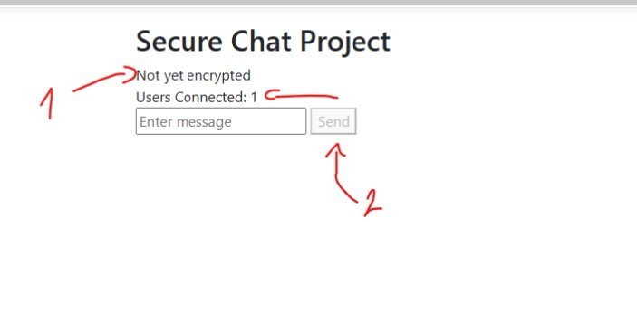
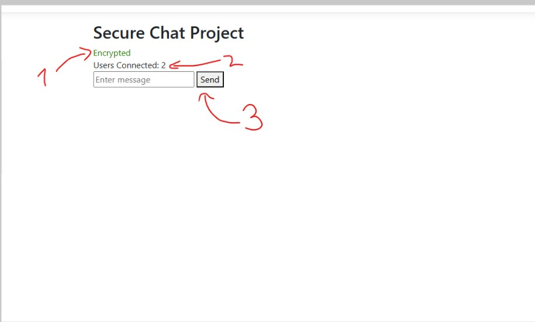
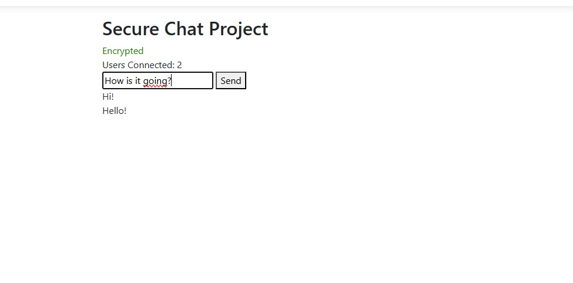

Secure chat
Kirstine J. Berantzino

Running the project:
   -    .Net 8, backend Runs on: `https://localhost:7174/chathub`
   -	Choose to run both the Client-project and the Server-project in the solution
   -	Frontend Runs on: https://localhost:7114/ (important for cors)
   -	HTTPS must be used to allow access to `SubtleCrypto` and other secure APIs
   -	You need to open the chat page in two different tabs or browsers to connect two separate ’users’
   -	When encryption has been enabled the ’ Not yet encrypted’ will change to ’encrypted’ and the send button will be possible to push.

Overview:
I have decided to use the hybrid cryptography-approach mentioned in the learning material. This means I use asymmetric key(private/public) to exchange session symmetric keys between the two users.
I’m attempting End-to-End encryption meaning the messages are encrypted/decrypted by the client only.

Files of interest:

	Server:
	SecureChat\Server\Hubs\ChatHub.cs

	Client:
	SecureChat\Client\Views\Home\Index.cshtml

Authentication:
RSA key exchange
   -	This is the asymmetric approach that is generated for each client ( 2048-bit RSA-OAEP, using SHA-256).
   -	The Clients exchange their public keys via Signal R and over HTTPS
   -	The RSA is then used to encrypt the AES session key. In theory the reason why I do not use the asymmetric keys each time is to avoid performance issues as mentioned in the learning material.
Examples of how this is done in the code:

	•	Generate RSA key pair:  crypto.subtle.generateKey({ name: "RSA-OAEP", ... })
	•	Export public key (SPKI): crypto.subtle.exportKey("spki", rsaKeyPair.publicKey)
	•	Import other clients key: crypto.subtle.importKey("spki", ..., { name: "RSA-OAEP", hash: "SHA-256" })
	•	Encrypt AES key for other: crypto.subtle.encrypt({ name: "RSA-OAEP" }, otherClientPublicKey, aesKey)
	•	Decrypt AES key received: crypto.subtle.decrypt({ name: "RSA-OAEP" }, rsaKeyPair.privateKey, data)
AES-GCM for sessions
	-	One client generates a256-bit AES-GCM key, which is then encrypted using the other clients public key, meaning only their private key can decrypt it again.
	-	All messages are then encrypted with the AES key and a randomly generated IV (12 bytes).
	-	The key is randomly generated. 
Code examples of how this is done:

	•	Generate AES key:	crypto.subtle.generateKey({ name: "AES-GCM", length: 256 }, ...)
	•	Encrypt a message	crypto.subtle.encrypt({ name: "AES-GCM", iv }, aesKey, plaintext)
	•	Decrypt a message	crypto.subtle.decrypt({ name: "AES-GCM", iv }, aesKey, ciphertext)
	•	Export raw AES key	crypto.subtle.exportKey("raw", aesKey)
	•	Import raw AES key (received)	crypto.subtle.importKey("raw", rawKey, "AES-GCM", true, ["encrypt", "decrypt"])
Integrity:
	-	AES-GCM has a built in authentication tag which provides integrity. But I wanted to try using the HMAC as well. Therefore the HMAC-SHA256 is used as well.
	-	The HMAC key is derived from the AES key so it is connected to each other. This means that every message has a base64 HMAC over the IV.CipherText ensuring that both the IV and ciphertext has not been touched by anyone. 

Examples from the code:
   • Import AES key as HMAC key: crypto.subtle.importKey("raw", rawKey, { name: "HMAC", hash: "SHA-256" })
   • Sign encrypted message: crypto.subtle.sign("HMAC", hmacKey, dataToSign)
   • Verify message integrity: crypto.subtle.verify("HMAC", hmacKey, signature, dataToVerify)

Backend:
   • The backend in this project consists of a Signal R-hub which only job is to send data back and forth ensuring that the server is not able to read the clients messages. 

Keys:
the keys (RSA and AES) are kept  inside JavaScript variables in the browser’s runtime context.

some of them are:
RSA Key Pair: rsaKeyPair
AES-GCM Key: aesKey 
HMAC Key: hmacKey	

These keys only exist as long as the tab is open. If it is refreshed or closed they're lost. 
With them being saved in the memory it means that a potential malicious person could get ahold of the keys if they had access to the browser
or has done cross-site scripting or have added malicious extension into the JS.

Web Crypto API
   -	Runs in native code
   -	Enforces the use of HTTPS
   -	Standard based and widely supported
Reasons for doing these things:
I choose to follow this because it is an tested approach, meaning it has been under scrutiny of others and have proven secure. 
I have decided to handle the encryption in the frontend. This is to try and make it End-to-End as possible, without letting the server know what the users are writing to each other. This also means that the code is exposed. But since I am relying on Kerckhoff’s principal and I keep all the cryptographic secrets on the client side I think this justifies the choice.

Pictures

---- Picture 1---

1) Encryption is not yet established
2) It is not possible to send a message
3) It is possible to see only 1 person is connected. The key exchange has not yet happened.

------Picture 2------
1) Encryption is established.
2) Users can now send data.
3) You can see 2 users are connected.
1. 

---Picture 3----

Here you can see where the messages are shown when they have been send

Sources used:
- Learning material available on Moodle
- https://www.youtube.com/watch?v=XECRfpM3P4M
- https://www.youtube.com/watch?v=cZTHGPn1jdU
- https://www.youtube.com/watch?v=OMuZ4UvKppg
- https://davidmyers.dev/blog/a-practical-guide-to-the-web-cryptography-api
- https://getstream.io/blog/web-crypto-api-chat
